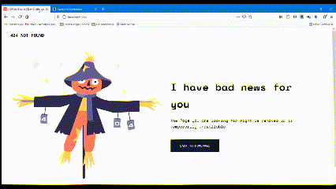

<!-- Please update value in the {}  -->

<h1 align="center">404 Not Found | Dev Challenge</h1>

   Solution for a challenge from  <a href="http://devchallenges.io" target="_blank">Devchallenges.io</a>.

  <h3>
    <a href="https://404-not-found-sansk.netlify.app/">
      Demo
    </a>
     | 
    <a href="https://https://github.com/sansk/404-not-found-devchallenges">
      Solution
    </a>
     | 
    <a href="https://devchallenges.io/challenges/wBunSb7FPrIepJZAg0sY">
      Challenge
    </a>
  </h3>

<!-- TABLE OF CONTENTS -->

## Table of Contents

- [Table of Contents](#table-of-contents)
- [Overview](#overview)
  - [Built With](#built-with)
- [Features](#features)
- [Acknowledgements](#acknowledgements)
- [Contact](#contact)

<!-- OVERVIEW -->

## Overview

This project is done as a part of this [dev challenge](https://devchallenges.io/challenges/wBunSb7FPrIepJZAg0sY). You can see the [Demo here](https://404-not-found-sansk.netlify.app/) and the [code here](https://github.com/sansk/404-not-found-devchallenges).

### Built With

<!-- This section should list any major frameworks that you built your project using. Here are a few examples.-->

- 
- 

## Features

<!-- List the features of your application or follow the template. Don't share the figma file here :) -->

This application/page was built to complete the given user stories using tailwind utility classes. No CSS apart from tailwind classes were used.

In addition to that I have applied some animations using tailwind utilities.

## Acknowledgements

<!-- This section should list any articles or add-ons/plugins that helps you to complete the project. This is optional but it will help you in the future. For exmpale -->

- [Tailwind CSS: From Zero to Production](https://www.youtube.com/playlist?list=PL5f_mz_zU5eXWYDXHUDOLBE0scnuJofO0)
- [Tailwind Docs](https://tailwindcss.com/docs/installation)

## Contact

- GitHub [@sansk](https://github.com/sansk)
- Twitter [@iamsangyk](https://twitter.com/iamsangyk)
